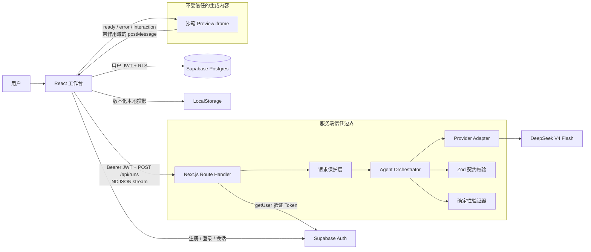

# BuildTrace 技术设计文档

> 状态：D2、D3 已确认（2026-09-07）
> 关联需求：[product-requirements.md](./product-requirements.md)  
> 关键决策：[ADR-0001：生成沙箱化的自包含 HTML](./decisions/0001-sandboxed-self-contained-html.md)
> 范围升级：[ADR-0002：Supabase 身份与本地优先云持久化](./decisions/0002-supabase-local-first-persistence.md)

## 1. 技术方案摘要

BuildTrace 采用 **本地优先的 Next.js 应用 + 服务端 Agent Orchestrator**：

- 使用 React + TypeScript 实现工作台；
- 使用 Next.js App Router 和 Route Handler 承载全栈应用；
- 使用 Tailwind CSS 建立视觉系统；
- 通过 Provider Adapter 隔离具体模型；D3 选择 DeepSeek V4 Flash，Fake Provider 保留为确定性测试替身；
- 使用 Zod 校验请求、事件、产物和模型结构化输出；
- 一个 `POST` 请求通过 NDJSON 流式返回事件；
- Pipeline 固定为 Product → Architecture → Engineering → Validation；
- 生成自包含 HTML，通过受限 `iframe srcDoc` 运行；
- 使用确定性规则验证 HTML、安全策略、预览就绪和交互；
- 使用 Supabase Auth 保存身份与会话，Postgres 保存项目和最近三个成功版本；
- 使用按用户隔离的版本化 LocalStorage 作为本地缓存和断网恢复层；
- 使用 Vitest 测试契约、状态和安全逻辑，使用 Playwright 测试核心浏览器流程。

这是经过主动约束的原型架构。它展示真实编排、失败恢复、安全边界和完整浏览器体验，但不假装支持任意代码仓库或生产级云应用。

## 2. 目标、约束与非目标

### 2.1 目标

- 每个可见 Pipeline 状态都来自真实操作；
- 展示有用进度，但不暴露模型隐藏推理；
- API Key 和模型调用只存在于服务端；
- 失败后能从当前阶段恢复，不丢失有效上游产物；
- Product Brief 修改后只重建下游内容；
- 在可信边界内预览可交互的模型生成代码；
- 实时模型不可用时，仍提供明确标记的完整预置体验。

### 2.2 约束

- 生成结果是一份受大小限制的 HTML，CSS 和 JavaScript 均内联；
- 生成应用不使用远程后端，也不动态安装依赖；
- 服务端任务与一次请求生命周期绑定，不假设已有持久任务队列；
- HTML 首版存入 Postgres，单份限制 150 KB，超过边界后迁移到 Supabase Storage；
- 模型已在 D3 锁定为 `deepseek-v4-flash`，部署平台留到 D4 决定；
- 公共访问可匿名查看预置项目，实时生成需要登录；费用保护同时依赖用户身份、应用限制与 Provider 硬预算。

### 2.3 非目标

- 运行生成的 Node.js、Python、Shell 或容器任务；
- 支持任意包管理器或多文件构建；
- 团队空间、共享项目、角色权限和多人并发编辑；
- 展示 Chain-of-Thought 或其他隐藏推理；
- 声称 iframe 可以让任意生成代码绝对安全。

## 3. 系统边界



### 3.1 模块职责

| 模块                    | 负责                                           | 不负责                             |
| ----------------------- | ---------------------------------------------- | ---------------------------------- |
| Workspace               | 收集输入、消费事件、展示产物、版本、日志和预览 | 直接调用模型或执行生成的服务端代码 |
| Request Guards          | 校验请求、限制大小/时间/频率、创建请求上下文   | 决定产品内容                       |
| Orchestrator            | 执行真实阶段、发送事件、错误分类、响应取消     | 持久化项目或伪造进度               |
| Provider Adapter        | 发起模型调用并统一结构化结果和错误             | 管理 UI 或项目状态                 |
| Contract Validation     | 拒绝不合规请求、事件和模型产物                 | 判断主观产品质量                   |
| Deterministic Validator | 解析输出、执行安全策略、插入监测代码并验证运行 | 运行任意后端代码                   |
| Supabase Auth           | 注册、登录、会话刷新与用户 JWT                 | 决定业务数据权限                   |
| Postgres + RLS          | 保存用户项目、产物、版本和首版 HTML            | 保存无限大小 Artifact              |
| Browser Storage         | 按用户保存本地投影并支持断网恢复               | 作为多设备并发的唯一事实来源       |
| Preview Sandbox         | 运行已接受的 HTML 并报告运行状态               | 访问父页面、凭证、Cookie 或网络    |

Next.js Route Handler 基于标准 Web `Request` 和 `Response` API，适合实现可迁移的流式接口。但它仍是公开 HTTP Endpoint，必须视为不可信边界。参见 [Next.js Backend for Frontend 指南](https://nextjs.org/docs/app/guides/backend-for-frontend)。

## 4. 运行流程

### 4.1 快速模式首次生成

1. 客户端校验输入，取得当前 Supabase Access Token，生成 `runId` 和幂等键；
2. 服务端重新校验请求，通过 Supabase `getUser` 验证 Bearer Token，并在调用模型前执行用户级限额检查；
3. Product Agent 一次返回 `IdeaAnalysis` 和 `ProductBrief`；
4. Architecture Agent 根据 Product Brief 返回 `TechnicalPlan`；
5. Engineering Agent 根据 Brief 和 Plan 返回 `GeneratedApp`；
6. Validation 解析、检查并转换生成文档；
7. Preview Sandbox 上报 ready 与交互证据；
8. 客户端先保存新的成功版本到用户分区 LocalStorage，再通过 RLS 写入 Supabase Postgres。

Idea Analysis 与 Product Brief 共享同一上下文，因此由一次 Product Agent 调用返回，以减少一次模型往返。界面会如实表明它们来自同一个阶段，不伪造成两个独立 Agent 操作。

### 4.2 引导模式

引导模式将目标用户、核心操作和约束随初始想法发送。Product Agent 生成相同产物，但客户端在 `ProductBrief` 后进入 `awaiting_user`。用户点击“开始构建”后，再自动执行 Architecture、Engineering 和 Validation。

### 4.3 Product Brief 重建

1. 客户端将修改后的 Brief 保存为新修订；
2. 固定依赖规则把 `technicalPlan`、`generatedApp` 和 `validation` 标记为 stale；
3. UI 明确列出受影响阶段；
4. 用户确认后，客户端携带修改后的 Brief 与有效上游上下文提交 `rebuildFrom: "architecture"`；
5. 服务端重新校验客户端产物，并执行 Architecture → Engineering → Validation；
6. 新版本通过前，上一个 ready 版本继续作为活动预览。

MVP 不实现通用依赖图。固定依赖链更容易测试，也足以证明局部下游重建能力。

### 4.4 重试与取消

- 客户端取消时中止 Fetch；
- Route Handler 将 `request.signal` 传递给 Orchestrator 和 Provider；
- 失败阶段记录标准化错误，已完成上游产物继续保留；
- 重试请求携带有效产物快照和 `retryFrom`，服务端必须重新执行 Schema 与大小校验；
- 同一幂等键在服务端有效窗口内不能重复发起付费调用。

## 5. 状态模型

### 5.1 Run 状态

```text
idle
  → running
  → awaiting_user       # 仅引导模式
  → running
  → ready

running → failed
running → cancelling → cancelled
failed  → retrying → running
ready   → rebuilding → ready | failed
```

### 5.2 Stage 状态

```text
queued → running → completed
                 ↘ failed → retrying → running

completed → stale → running
queued | running → cancelled
```

### 5.3 不变量

- 一个 Run 同时最多有一个模型阶段处于 `running`；
- 上游必需产物未通过校验时，下游不能开始；
- `ready` 必须同时满足产物已接受、阻塞检查通过和 iframe 就绪握手成功；
- 重建失败不能替换 `activeVersionId`；
- Run 内事件 `sequence` 必须单调递增；
- stale 产物可查看，但不能被静默用于新构建。

## 6. 事件协议

`POST /api/runs` 返回 `application/x-ndjson`，每一行都是可以独立解析的 JSON 事件。相比浏览器 `EventSource`，NDJSON 更适合携带结构化 `POST` 请求体的一次性生成任务。

```ts
type StageId = "product" | "architecture" | "engineering" | "validation";

type RunEvent =
  | Event<"run.accepted", RunMetadata>
  | Event<"stage.started", StageMetadata>
  | Event<"stage.progress", PublicProgress>
  | Event<"artifact.completed", ArtifactEnvelope>
  | Event<"stage.completed", StageSummary>
  | Event<"validation.completed", ValidationReport>
  | Event<"stage.failed", PublicStageError>
  | Event<"run.awaiting_user", AwaitingUserPayload>
  | Event<"run.completed", CompletedRun>
  | Event<"run.cancelled", CancelledRun>;

type Event<TType extends string, TPayload> = {
  protocolVersion: 1;
  runId: string;
  sequence: number;
  timestamp: string;
  type: TType;
  stage?: StageId;
  payload: TPayload;
};
```

协议规则：

- 服务端只通过一个 Event Writer 输出，保证顺序；
- Heartbeat 只保持连接，不能推进阶段状态；
- `stage.progress` 只能包含简短公开状态，不能包含隐藏推理；
- 客户端记录并忽略未知协议版本或事件类型，不能因此破坏已有状态；
- 每个 Run 只允许一个终止事件，发送后关闭 Stream。

## 7. 请求与模型输出契约

Zod 是运行时契约的单一事实来源。TypeScript 类型由 Schema 推导；支持 Structured Output 的 Provider 使用生成的 JSON Schema。相关能力见 [Zod JSON Schema 文档](https://zod.dev/json-schema)。

### 7.1 请求

```ts
const RunRequestSchema = z.object({
  protocolVersion: z.literal(1),
  runId: z.string().uuid(),
  idempotencyKey: z.string().min(16).max(128),
  mode: z.enum(["quick", "guided"]),
  action: z.enum(["initial", "continue", "retry", "rebuild"]),
  prompt: z.string().trim().min(10).max(2_000),
  context: z
    .object({
      audience: z.string().max(300).optional(),
      primaryAction: z.string().max(300).optional(),
      constraints: z.array(z.string().max(200)).max(8).optional(),
    })
    .optional(),
  retryFrom: StageIdSchema.optional(),
  rebuildFrom: StageIdSchema.optional(),
  artifacts: ArtifactSnapshotSchema.optional(),
});
```

### 7.2 Product Agent 输出

```ts
const ProductAgentOutputSchema = z.object({
  ideaAnalysis: z.object({
    problem: z.string().min(20).max(800),
    audience: z.string().min(10).max(500),
    assumptions: z.array(z.string().max(240)).min(1).max(6),
    risks: z.array(z.string().max(240)).max(6),
  }),
  productBrief: z.object({
    productName: z.string().min(2).max(80),
    valueProposition: z.string().min(20).max(300),
    primaryUser: z.string().min(10).max(300),
    primaryAction: z.string().min(10).max(300),
    functionalRequirements: z.array(z.string().max(240)).min(2).max(8),
    acceptanceCriteria: z.array(z.string().max(240)).min(2).max(8),
    constraints: z.array(z.string().max(240)).max(8),
    outOfScope: z.array(z.string().max(240)).max(8),
  }),
});
```

### 7.3 Architecture Agent 输出

```ts
const TechnicalPlanSchema = z.object({
  interactionModel: z.string().min(20).max(600),
  dataModel: z
    .array(
      z.object({
        name: z.string().max(80),
        fields: z.array(z.string().max(120)).max(12),
      }),
    )
    .max(8),
  components: z
    .array(
      z.object({
        name: z.string().max(80),
        responsibility: z.string().max(240),
      }),
    )
    .min(2)
    .max(12),
  behaviors: z.array(z.string().max(240)).min(1).max(12),
  validationPlan: z.array(z.string().max(240)).min(1).max(10),
});
```

### 7.4 Engineering Agent 输出

```ts
const GeneratedAppSchema = z.object({
  title: z.string().min(2).max(100),
  summary: z.string().min(20).max(300),
  html: z.string().min(300).max(MAX_HTML_BYTES),
  implementedRequirementIds: z.array(z.string()).min(1),
});
```

每个 Agent 只接收当前阶段必要的最小上下文。原始 Provider 响应不发送到浏览器，也不写入普通应用日志。Schema 失败时最多允许一次受限的结构化修复，仍失败则明确结束当前阶段。

## 8. Provider Adapter

模型已在 D3 锁定为 DeepSeek V4 Flash。应用仍只依赖内部接口，Fake Provider 与真实 Provider 使用同一 Orchestrator：

```ts
interface ModelProvider {
  readonly id: "fake" | "deepseek";
  readonly label: string;
  generateProduct(prompt, signal): Promise<ProductAgentOutput>;
  generateTechnicalPlan(prompt, product, signal): Promise<TechnicalPlan>;
  generateApp(prompt, product, technicalPlan, signal): Promise<GeneratedApp>;
}
```

DeepSeek 实现通过 `https://api.deepseek.com/responses` 调用 Responses API，并为三个阶段分别发送由 Zod Schema 转换的 JSON Schema。初次 Spike 证明 3,000 Token 会在 Architecture 阶段截断包含推理 Token 的响应，因此 Product、Architecture、Engineering 的最大输出调整为 8,000、8,000、24,000 Token。Product 与 Architecture 默认超时 45 秒；ROI Spike 证明复杂页面的 Engineering 可能超过 45 秒，因此该阶段单独使用 75 秒上限，Route 的部署时长声明为 180 秒。Key 只从服务端 `DEEPSEEK_API_KEY` 读取。官方能力与接口依据见 [DeepSeek Responses API](https://api-docs.deepseek.com/guides/responses_api/) 和 [模型与价格](https://api-docs.deepseek.com/zh-cn/quick_start/pricing/)。

错误统一映射：

| 类型                      | 是否可重试   | 用户行为                      |
| ------------------------- | ------------ | ----------------------------- |
| `provider_rate_limited`   | 有限重试     | 展示等待建议，不静默循环      |
| `provider_timeout`        | 是           | 重试失败阶段或查看预置项目    |
| `provider_invalid_output` | 结构修复一次 | 明确说明契约错误              |
| `provider_rejected`       | 按状态决定   | 建议修改输入或重试            |
| `provider_configuration`  | 否           | 检查开关、Key、次数或预算限制 |
| `provider_authentication` | 否           | 检查服务端 Key 与模型权限     |
| `provider_unavailable`    | 有限重试     | 保留已有产物并提供重试        |
| `internal`                | 不自动重试   | 返回请求 ID，不暴露敏感详情   |

## 9. 生成内容安全边界

即使内容来自模型，也必须视为不受信任输入。

### 9.1 静态校验与转换

进入 Preview 前，服务端验证器必须：

1. 限制字节数和 DOM 嵌套深度；
2. 将 HTML 解析为 AST，不能只依赖正则表达式；
3. 要求存在 `body` 和可见内容；
4. 禁止 iframe、object、embed、meta refresh、外部脚本/样式、危险 URL 协议和顶层导航；
5. 根据自包含契约禁止远程网络依赖；
6. 注入严格 CSP；
7. 注入最小 Runtime Bridge，上报 ready、error、unhandled rejection 和 interaction；
8. 将同一份已接受文档同时提供给 Code 与 Preview。

注入文档的 CSP 等价于：

```text
default-src 'none';
script-src 'unsafe-inline';
style-src 'unsafe-inline';
img-src data: blob:;
font-src data:;
connect-src 'none';
media-src data: blob:;
object-src 'none';
frame-src 'none';
form-action 'none';
base-uri 'none';
```

### 9.2 Iframe 策略

Preview 使用 `srcDoc` 和 `sandbox="allow-scripts"`，且不启用：

- `allow-same-origin`；
- 表单提交、弹窗、下载、Pointer Lock 或顶层导航；
- 父页面 DOM、Cookie 和浏览器存储访问；
- CSP 规则之外的网络访问。

MDN 将 `srcdoc` 明确列为潜在注入入口，并建议在不需要访问父页面时使用不含 `allow-same-origin` 的 Sandbox；同时不建议对同源内容组合使用 `allow-scripts` 与 `allow-same-origin`。参见 [`srcdoc` 安全说明](https://developer.mozilla.org/en-US/docs/Web/API/HTMLIFrameElement/srcdoc)和 [`iframe` Sandbox 参考](https://developer.mozilla.org/en-US/docs/Web/HTML/Reference/Elements/iframe)。

### 9.3 Preview 通信

不带 `allow-same-origin` 的 `srcdoc` Frame 使用不透明 Origin，因此父页面只接受同时满足以下条件的消息：

- `event.source === iframe.contentWindow`；
- 消息通过 `PreviewEventSchema`；
- 消息带有校验后注入、不可预测且仅当前 Run 有效的 Channel Token；
- 消息类型在允许列表内；
- Payload 大小不超过限制。

Frame 因不透明 Origin 必须使用 `postMessage(..., "*")`，所以消息中不得包含密钥或用户正文。父页面以 `source + token + schema` 作为有效通道边界。参见 [`postMessage` 安全建议](https://developer.mozilla.org/en-US/docs/Web/API/Window/postMessage)。

### 9.4 诚实限制

以上措施能显著限制影响，但不能证明任意 HTML/JavaScript 绝对安全。生产系统应把构建和预览放在独立 Origin，通过隔离 Worker/Container、独立响应头、资源配额和持续安全测试进一步收紧边界。

## 10. 确定性验证

验证结果必须来自可复现证据，而不是通用 LLM 评价。

| 检查                    | 是否阻塞 | 证据                                      |
| ----------------------- | -------- | ----------------------------------------- |
| 请求与产物 Schema       | 是       | Zod 解析结果                              |
| 输出大小和单文件限制    | 是       | 字节数与文档数量                          |
| HTML 可解析且有可见主体 | 是       | AST 检查                                  |
| 禁止元素、URL 和能力    | 是       | 命中的 Policy Rule ID                     |
| 需求映射存在            | 是       | ID 属于 Product Brief 验收项              |
| Preview 在时限内 ready  | 是       | 带 Run Token 的 iframe 握手               |
| 启动期间无运行错误      | 是       | `error` / `unhandledrejection` 事件       |
| 至少存在有效交互        | 是       | 静态交互目标 + Runtime Interaction Signal |
| 响应式启发式检查        | 警告     | viewport meta 与溢出检查                  |
| 主观产品质量评价        | 信息     | 如增加模型或人工评价，必须明确标记        |

Preview Ready Timeout 与模型生成超时分开计算。不能只用 iframe `load` 事件作为成功，因为浏览器出于安全原因不会通过该事件暴露所有加载错误。

## 11. 持久化与版本

### 11.1 数据模型

- `projects`：当前项目快照，包含 `user_id`、Prompt、Run/Stage 状态、Product/Technical/Generated 产物、活动版本、错误与修订；
- `project_versions`：最近三个成功版本，包含结构化产物、确定性检查和 `accepted_html`；
- HTML 首版按文本存入 Postgres，数据库和 Zod 都限制为 150 KB；超过这个门槛迁移到 Supabase Storage，并只在版本行保存对象引用和摘要；
- 当前 UI 只恢复用户最近保存的项目，Schema 支持后续增加项目列表。

两张表都引用 `auth.users` 并启用 RLS。匿名角色没有表权限；`authenticated` 角色获得明确 CRUD Grants 后，还必须通过每类操作的 Owner Policy。版本写入额外检查父项目属于同一 `auth.uid()`。仓库和部署环境不使用 `service_role` Key。

### 11.2 本地缓存与同步

- LocalStorage 使用 `schemaVersion: 2`，Key 按 `guest` 或 Supabase User ID 分区；
- 快照包含校验信息、时间、产物修订、活动版本和最近成功预览；
- 每次读取都先通过 Zod Schema 校验，损坏或未知版本进入安全降级；
- 容量不足时压缩为当前成功版本，仍失败则明确提示而不假装已保存；
- 登录时只比较当前用户本地快照与云端快照，`savedAt` 较新的版本胜出；
- 两者都为空时才迁入游客快照，并重新生成项目和版本 ID，避免跨用户主键冲突；
- 退出后立即切回游客分区；云端失败不阻断本地写入，用户手动重试或浏览器恢复联网时重新拉取并合并。

Last-Write-Wins 是单用户原型取舍。客户端时钟可被修改，也无法安全合并并发字段；生产版需要服务端 Revision、条件更新与冲突 UI。

### 11.3 后续演进

Run、Event、用量和审计记录仍需迁移到持久任务系统。浏览器继续作为可恢复投影，服务端 Revision 成为多设备事实来源；大体积 Artifact 迁移到带生命周期策略的对象存储。

## 12. 公共 Demo 保护

### 12.1 应用代码内强制执行

- 在模型调用前检查 Prompt 与 Artifact 大小；
- 每个阶段限制最大输出 Token；
- 设置请求与阶段超时；
- 结构化输出最多自动修复一次；
- 手动重试次数受限；
- 使用不透明 Session ID 与尽力而为的滑动窗口限流；
- 通过幂等键合并正在运行的重复请求；
- 客户端只收到通用错误和 Request ID；
- Provider Secret、原始响应和完整 Prompt 不进入客户端包和普通服务端日志；
- Feature Flag 可关闭实时生成并展示有明确标记的预置项目。
- 配置 Supabase 后，`/api/runs` 要求 Bearer Token，并通过 Auth 服务端 `getUser` 结果绑定用户预算；不信任客户端提交的用户 ID。
- 本地阶段限制单进程最多 15 次真实运行、单浏览器会话最多 3 次；幂等键重复请求不重复计数。
- 根据 DeepSeek 人民币高峰单价和响应 `usage` 保守累计应用侧费用，并为每次接受的完整运行（含最多一次结构化修复）预留 ¥0.65；15 次预留总额为 ¥9.75，低于 D3 的 ¥10 上限。

### 12.2 应用之外执行

- 设置 Provider Project Budget 和用量告警；
- 在部署平台支持时启用请求或防火墙限制；
- Key 只存储于服务端环境变量；
- 开发环境与公共预览使用不同凭证。

### 12.3 已知限制

内存限流和费用累计无法在多个 Serverless Instance 之间保持全局一致，进程重启后也会清零。它只能作为本地阶段的纵深防御，不能成为唯一预算边界。D3 已确认 ¥10 上限；D4 前仍需在 DeepSeek 控制台确认账户额度或告警，并决定公共 Demo 是否开放实时生成。生产方案需要 Redis 等共享配额存储和带身份的租户限额。

## 13. 前端结构

工作台由一个只消费已校验 `RunEvent` 的 Reducer 驱动：

```text
BuilderPage
├── ProjectHeader
├── StageRail
│   ├── StageStatusItem
│   └── VersionList
├── Workbench
│   ├── IdeaComposer
│   ├── AgentActivity
│   └── ArtifactCard
│       └── ProductBriefEditor
└── Inspector
    ├── PreviewPanel
    ├── CodePanel
    ├── LogsPanel
    └── ValidationPanel
```

状态分为三类：

- **Server Event State**：Run、Stage、Artifact、公开日志与 Validation；
- **Local UI State**：活动标签、展开卡片、编辑草稿、预览宽度；
- **Persisted Project State**：已接受产物和成功版本。

客户端先缓存不完整 NDJSON 文本，遇到换行后再逐行解析；每个事件都必须通过 Schema 才能进入 Reducer。流中断时进入 `transport_interrupted`，此前已接受产物继续保留。

## 14. 测试策略

### 14.1 Vitest 单元与契约测试

- 合法和非法状态转换；
- 事件排序、重复事件和未知协议版本；
- 请求、产物和错误 Schema；
- 下游 stale 传播；
- 取消、失败、重试和重建后的 Reducer 行为；
- HTML Policy、CSP 注入和 Preview Bridge；
- 存储迁移、损坏、容量限制和淘汰；
- 限流与幂等边界。

### 14.2 集成测试

- 使用确定性 Fake Provider 完成 Orchestrator 成功流程；
- 注入 Product、Architecture、Engineering 非法输出；
- 验证 Timeout、Abort、Quota 和 Retry 映射；
- 验证器阻止外部资源和禁止导航；
- 重建失败时活动版本保持不变。

### 14.3 Playwright 浏览器测试

- 快速示例 → 真实事件流 → Preview Ready；
- 引导模式只暂停一次，点击 Build 后继续；
- 编辑 Brief → 下游 stale → 重建 → 新版本；
- 运行错误显示在 Logs 并阻止 Ready；
- 刷新后恢复最近成功状态；
- 键盘访问和状态 Live Region；
- 预置流程明确标记且不调用模型。

### 14.4 真实模型冒烟测试

D3 已选定 `deepseek-v4-flash`。本机 Key 配置完成后，先用两个固定提示词做 Provider Spike，再使用五个固定提示词记录 Schema 成功率、延迟、Token、估算费用、验证结果、运行就绪、交互和人工观察。Fake Provider E2E 只能证明应用行为确定，不能作为真实模型质量证据。

## 15. 需求追踪

| 需求                   | 主要实现                                    | 验证方式                           |
| ---------------------- | ------------------------------------------- | ---------------------------------- |
| M1 创建模式和示例      | `IdeaComposer`、Request Schema              | Playwright 快速/引导流程           |
| M2 真实分阶段 Pipeline | Orchestrator、Event Writer、Reducer         | 契约 + 集成 + E2E                  |
| M3 结构化产物          | Zod Output、`ArtifactCard`、Editor          | Schema + 查看/编辑 E2E             |
| M4 可运行微型产品      | Engineering Agent、HTML Contract            | 五提示词 + Sandbox Run             |
| M5 Preview 与验证      | Validator、iframe、Inspector                | 安全单测 + E2E                     |
| M6 下游重建            | Artifact Revision、Stale Reducer            | 状态单测 + Rebuild E2E             |
| M7 失败/取消/重试      | Error Normalizer、AbortSignal、Retry API    | 故障注入 + E2E                     |
| M8 持久化与保护        | `ProjectStore`、Request Guards、Preset Flag | 存储/安全测试 + Bundle Scan        |
| M9 账号与云同步        | Supabase Auth、Postgres、RLS、Local Cache   | Auth 单测 + Policy 检查 + 集成 E2E |

## 16. 最高风险与验证顺序

| 顺序 | 假设                                    | 扩展 UI 前的验证方式                               |
| ---: | --------------------------------------- | -------------------------------------------------- |
|    1 | 选定模型能稳定返回受限结构化产物和 HTML | D3 后用两个固定提示词做 Provider Spike             |
|    2 | 部署链路不会缓存或提前终止 NDJSON       | 本地测试后，在 D4 预览部署中验证                   |
|    3 | 受限 CSP 与 iframe 仍支持预期交互       | 使用固定 HTML Fixture 测试 ready/error/interaction |
|    4 | Brief 重建能改变结果且不破坏版本        | Fake Provider 集成测试 + Playwright                |
|    5 | 已登录公共 Demo 的成本限制足够          | 用户 Token、D3 用量估算、Provider 硬预算和限额测试 |
|    6 | RLS 能阻止跨账号读写                    | Policy 静态检查 + 两账户远程集成测试               |

流式行为必须在最终部署平台实测，因为代理或 Serverless Runtime 可能缓存或中断响应。相关注意事项见 [Next.js Streaming 部署说明](https://nextjs.org/docs/app/guides/self-hosting)。

## 17. 原型到生产的演进

| MVP                    | 生产方向                                       |
| ---------------------- | ---------------------------------------------- |
| 请求生命周期内顺序编排 | 持久工作流引擎 + Stage Job Queue               |
| 一次 NDJSON 响应       | 可重连、可回放的持久 Event Log                 |
| 单进程幂等窗口         | 数据库幂等键 + 分布式锁                        |
| Postgres 中的小型 HTML | Supabase Storage + 摘要、校验和与生命周期清理  |
| 一份自包含 HTML        | 隔离的多文件 Build Service + Artifact Registry |
| 同应用 `srcdoc` 沙箱   | 独立 Origin Preview + Container 隔离           |
| 本地尽力限流           | 按 Tenant、IP、预算执行的 Redis/Edge Quota     |
| 单一 Provider Adapter  | 按能力路由并支持 Fallback                      |
| 基础请求日志           | Trace、Metric、结构化日志、成本归因和告警      |
| 单用户身份与 Owner RLS | 团队租户、角色、共享、权限与审计               |

生产环境中，`POST /runs` 应只负责校验、入队并立即返回 Run ID。Worker 通过 Lease 领取 Stage，持久化产物修订和事件，并通过可重连 Stream 发布进度。幂等键和 Attempt Number 保证安全重试，避免浏览器断开或 Serverless Timeout 决定长任务生命周期。

## 18. 主动取舍

### 自包含 HTML，而不是任意仓库

牺牲框架多样性和生成后端，换取确定性启动、无动态依赖供应链、受限输出和稳定预览。详见 ADR-0001。

### 固定 Pipeline，而不是动态 Agent 规划

已知依赖链更容易观察、验证、重试和解释。只有固定流程可靠且积累评估数据后，动态委派才值得引入。

### 本地优先，而不是只依赖数据库

Supabase 提供跨设备事实来源与 RLS 隔离；LocalStorage 仍承担即时写入、刷新恢复和断网降级。它不是第二套共享数据库，只有当前用户的最近项目投影，并通过显式冲突规则与云端合并。详见 ADR-0002。

### NDJSON，而不是 WebSocket

当前交互是一次请求范围内、以服务端到客户端为主的 Stream。NDJSON 支持 `POST` 和原生 Stream，基础设施更简单；持久双向通信属于生产演进。

## 19. D2、D3、D4 锁定结论

D2 已确认，本方案锁定：

- PRD 中的 Must / Should / Won't；
- 快速模式为默认，引导模式只在 Product Brief 暂停一次；
- Product Brief 可编辑，并按固定依赖规则使下游失效；
- Product、Architecture、Engineering 和确定性 Validation 四阶段；
- Next.js + React + TypeScript + Tailwind + Zod；
- NDJSON 流式协议；
- 受限的自包含 HTML 和 Sandbox Preview；
- 带版本的本地优先持久化；
- D2 通过后可以初始化本地 Git，并使用 Fake Provider 开始编码。
- D3 采用 DeepSeek V4 Flash（`deepseek-v4-flash`），费用上限 ¥10；Key 只进入未追踪的 `.env.local` 或部署平台 Secret。
- 本地保护采用 15 次单进程运行上限、3 次单会话上限、每次 ¥0.65 预算预留、最多一次结构化修复、阶段 Token 上限、产品/架构 45 秒和工程 75 秒超时。
- D4 采用 Vercel Hobby，通过本地 CLI 部署且不连接 GitHub；生产 Secret 由候选人在 Dashboard 配置。
- 公开生成接口使用 Vercel WAF 按 IP 每 600 秒最多 3 次请求，应用侧预算保护作为第二层边界。
- D5 后范围升级采用 Supabase Auth + Postgres；实时生成要求登录，Owner RLS 隔离项目和版本，LocalStorage 继续作为按用户分区的断网恢复层。
- 首版 HTML 存入 Postgres 且限制为 150 KB，规模扩大后迁移 Supabase Storage；不配置 `service_role` Key。

以下事项仍不锁定：公开仓库配置（D5）。
